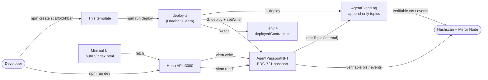
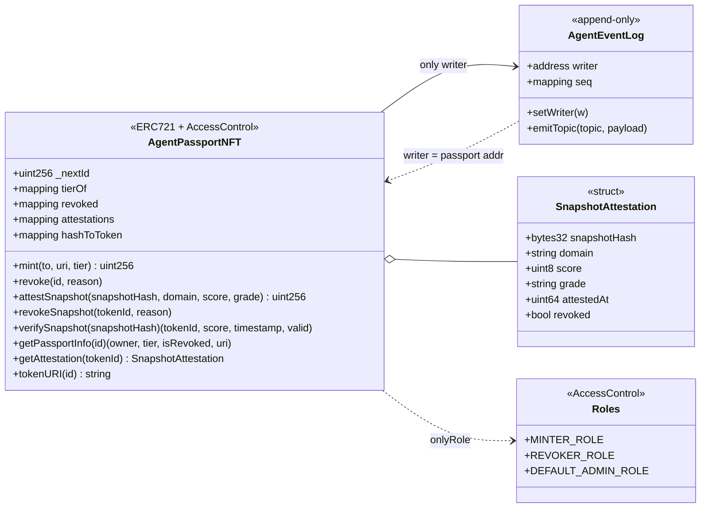
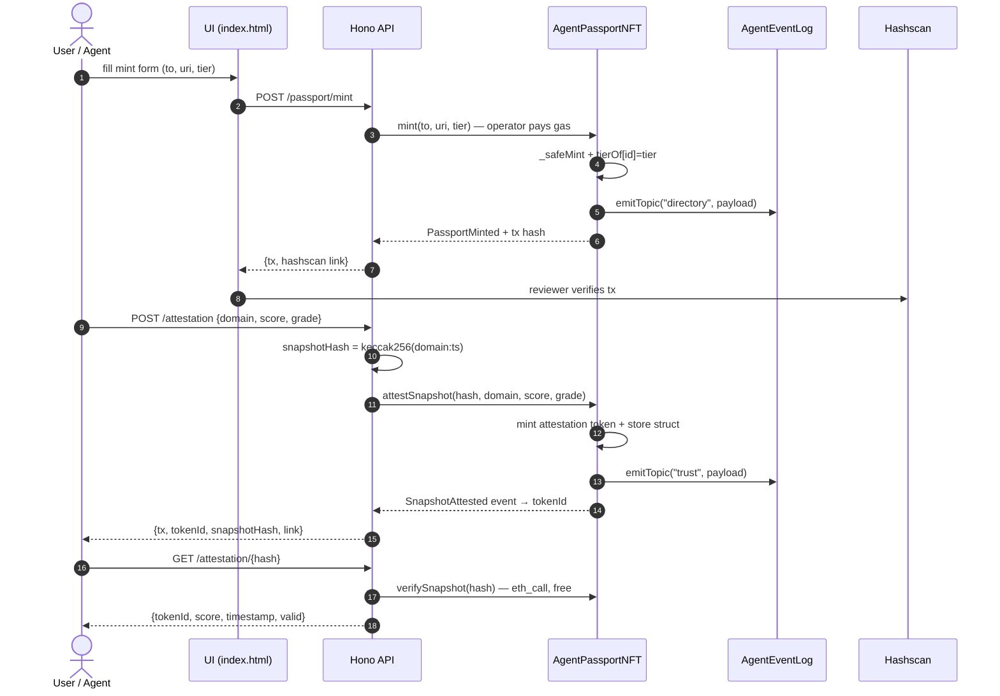

# hedera-agent-passport

> `scaffold-hbar` template — mint an on-chain passport for an AI agent on
> Hedera. An ERC-721 identity contract + an append-only attestation log
> (HSCS/EVM analogues of HTS tokens and HCS topics), wired to a small Hono
> API and a minimal UI. Every action produces a verifiable Hashscan link.

## Use case

AI agents need portable, verifiable identity. This template gives you the
smallest working slice of that pattern:

- **AgentPassportNFT** (`packages/hardhat/contracts/`) — an ERC-721 where
  each token is an agent passport: `tier` (1–4), `tokenURI` pointing at
  metadata, revoke support, plus **snapshot attestations** — a hash of
  any off-chain artifact (readiness scan, benchmark, model card) bound
  on-chain with score + grade.
- **AgentEventLog** — an ordered append-only event stream (`topic → seq →
payload`), the EVM analogue of a Hedera Consensus Service topic. Only
  the passport contract can write, so every mint / revoke / attestation
  leaves an immutable audit trail.
- **packages/app** — a Hono API that wraps the contracts: `mint`,
  `attest`, `read`, `verify` — each response includes a Hashscan URL so
  a reviewer can verify the transaction without trusting your code.

## Quickstart

Prerequisites: Node.js ≥ 18, a free Hedera **testnet** account with an
**ECDSA** private key (create at https://portal.hedera.com — the faucet
gives test HBAR instantly).

```bash
# 1. Scaffold a fresh project from this template
npm create scaffold-hbar@latest my-agent-passport -- --template spreadzp/template-hedera-agent-passport

cd my-agent-passport

# 2. Configure credentials
cp .env.example .env
#    fill HEDERA_OPERATOR_ID + HEDERA_PRIVATE_KEY (0x-prefixed ECDSA hex)

npm install

# 3. Deploy contracts to Hedera testnet
npm run deploy            # writes PASSPORT_CONTRACT / EVENTLOG_CONTRACT into .env
                          # and packages/app/deployedContracts.ts

# 4. Smoke check (optional): mints one passport + writes DEPLOYMENTS.md
npm run smoke

# 5. Run the API + UI
npm run dev               # → http://localhost:3000
```

Open http://localhost:3000 — mint a passport, post an attestation, click
the Hashscan links to verify on-chain.

## Repo layout

```
hedera-agent-passport/
├── packages/
│   ├── hardhat/              # contracts + deploy + tests
│   │   ├── contracts/        #   AgentPassportNFT.sol, AgentEventLog.sol
│   │   ├── scripts/          #   deploy.ts (→ .env + deployedContracts.ts)
│   │   │                     #   smoke.ts  (mint + DEPLOYMENTS.md)
│   │   ├── test/             #   vitest on local EDR (no network)
│   │   └── hardhat.config.ts #   hederaTestnet (chainId 296, Hashio RPC)
│   └── app/                  # Hono API + static UI
│       ├── src/hedera.ts     #   viem clients, chain defs, ABI surface
│       ├── src/index.ts      #   routes (see below)
│       ├── deployedContracts.ts  # generated by `npm run deploy`
│       └── public/index.html #   minimal mint/attest/read UI
├── template.json             # create-scaffold-hbar manifest
├── DEPLOYMENTS.md            # testnet addresses + tx links (proof)
├── .env.example              # all variables, commented
└── AGENTS.md                 # guide for AI coding agents
```

## How it works

### System overview



Key wiring decisions:

- `AgentEventLog.writer` is set to the **passport contract address** at
  deploy — EOAs cannot call `emitTopic` directly; writes only happen as
  a side-effect of passport operations. This guarantees the audit log
  can never be written out-of-band.
- The API holds the **operator key** (`HEDERA_PRIVATE_KEY`) and pays
  gas for every write — callers never need a wallet.
- Attestations are passports too: `attestSnapshot` mints a token whose
  on-chain `SnapshotAttestation` struct binds `snapshotHash → tokenId`.

### Contract model



Event log topics (each `emitTopic` appends `TopicEvent(topic, seq++, payload, timestamp)`):

| Contract call    | Topic       | Payload                                               |
| ---------------- | ----------- | ----------------------------------------------------- |
| `mint`           | `directory` | `("passport_issued", id, to, tier)`                   |
| `revoke`         | `audit`     | `("passport_revoked", id, reason)`                    |
| `attestSnapshot` | `trust`     | `("snapshot_attested", tokenId, hash, domain, score)` |
| `revokeSnapshot` | `trust`     | `("snapshot_revoked", tokenId, reason)`               |

### Request flow — mint + attestation



## API

| Method | Route                | What it does                                           |
| ------ | -------------------- | ------------------------------------------------------ |
| GET    | `/health`            | liveness + chainId                                     |
| GET    | `/contracts`         | deployed addresses + Hashscan links                    |
| POST   | `/passport/mint`     | `{ to?, uri?, tier? }` → mint, returns tx + link       |
| POST   | `/attestation`       | `{ domain, score, grade }` → attests snapshot on-chain |
| GET    | `/passport/:id`      | owner, tier, tokenURI, revoked flag                    |
| GET    | `/attestation/:hash` | `verifySnapshot` → score/timestamp/valid               |
| GET    | `/`                  | minimal UI (forms → API → Hashscan link)               |

### `GET /health`

Liveness probe — no chain interaction.

```bash
curl -s http://localhost:3000/health
# → {"ok":true,"chain":"Hedera Testnet","chainId":296}
```

### `GET /contracts`

Deployed addresses from `deployedContracts.ts` / env, with Hashscan links.

```bash
curl -s http://localhost:3000/contracts
# → {"passport":"0xc7b4…","eventLog":"0x8637…","chainId":296,
#    "hashscan":{"passport":"https://hashscan.io/testnet/contract/0xc7b4…", …}}
```

### `POST /passport/mint`

Mints a passport NFT. Operator key signs and pays gas.

| Param  | Type      | Default                   | Constraint          |
| ------ | --------- | ------------------------- | ------------------- |
| `to`   | `address` | operator address          | `0x` + 40 hex chars |
| `uri`  | `string`  | `ipfs://agent-passport/…` | metadata URI        |
| `tier` | `number`  | `1`                       | `1–4` (bronze→plat) |

```bash
curl -s -X POST http://localhost:3000/passport/mint \
  -H 'content-type: application/json' \
  -d '{"to":"0x48C9b8C9B47f5f324FC091a4A64f933453A49478","tier":2,"uri":"ipfs://agent-passport/api-mint"}'
# → {"ok":true,"tx":"0xb704…","status":"success","to":"0x48C9…","tier":2,
#    "hashscan":"https://hashscan.io/testnet/transaction/0xb704…"}
```

### `POST /attestation`

Attests an off-chain snapshot (readiness scan, benchmark…) on-chain.
Mints an attestation passport and appends to the `trust` event topic.

| Param          | Type      | Default                       | Constraint    |
| -------------- | --------- | ----------------------------- | ------------- |
| `domain`       | `string`  | `example.com`                 | any string    |
| `score`        | `number`  | `90`                          | `0–100`       |
| `grade`        | `string`  | `A`                           | e.g. `A`–`F`  |
| `snapshotHash` | `bytes32` | `keccak256(domain:timestamp)` | `0x` + 64 hex |

```bash
curl -s -X POST http://localhost:3000/attestation \
  -H 'content-type: application/json' \
  -d '{"domain":"agentbadge.xyz","score":92,"grade":"A"}'
# → {"ok":true,"tx":"0xa405…","status":"success","tokenId":"2",
#    "snapshotHash":"0x0410f1bc…","hashscan":"https://hashscan.io/testnet/transaction/0xa405…"}
```

> Re-attesting the same `snapshotHash` reverts `Hash already attested` —
> attestations are immutable (but can be revoked via `revokeSnapshot`).

### `GET /passport/:id`

Reads passport state — `eth_call`, free, no gas.

```bash
curl -s http://localhost:3000/passport/1
# → {"tokenId":"1","owner":"0x48C9…","tokenURI":"ipfs://…",
#    "tier":1,"revoked":false,"hashscan":"https://hashscan.io/testnet/contract/0xc7b4…"}
```

404 when the token does not exist.

### `GET /attestation/:hash`

Verifies a snapshot hash against on-chain attestations.

```bash
curl -s http://localhost:3000/attestation/0x0410f1bc3d71a368ff1e7dd4396c8ee0279bbfd52739919c14e5391740257df3
# → {"snapshotHash":"0x0410…","tokenId":"2","score":92,
#    "timestamp":1791017864,"valid":true}
```

`valid:false` + `tokenId:"0"` means "never attested"; `valid:false` with
a real `tokenId` means "attested but revoked".

## Contract reference

### `AgentPassportNFT` — writes (operator role required)

| Method                                                                                     | Role    | Description                                                  |
| ------------------------------------------------------------------------------------------ | ------- | ------------------------------------------------------------ |
| `mint(address to, string uri, uint8 tier) → uint256 id`                                    | MINTER  | passport NFT; emits `PassportMinted` + `directory` topic     |
| `revoke(uint256 id, string reason)`                                                        | REVOKER | marks `revoked[id]`; emits `PassportRevoked` + `audit` topic |
| `attestSnapshot(bytes32 hash, string domain, uint8 score, string grade) → uint256 tokenId` | MINTER  | attestation NFT; reverts on duplicate hash / score>100       |
| `revokeSnapshot(uint256 tokenId, string reason)`                                           | REVOKER | flags attestation revoked; `trust` topic                     |

### `AgentPassportNFT` — reads (free `eth_call`)

| Method                            | Returns                                     |
| --------------------------------- | ------------------------------------------- |
| `ownerOf(id)`                     | token owner (ERC-721)                       |
| `tokenURI(id)`                    | metadata URI                                |
| `tierOf(id)`                      | `uint8` tier 1–4                            |
| `revoked(id)`                     | `bool`                                      |
| `getPassportInfo(id)`             | `(owner, tier, isRevoked, uri)` in one call |
| `verifySnapshot(bytes32 hash)`    | `(tokenId, score, timestamp, valid)`        |
| `getAttestation(uint256 tokenId)` | full `SnapshotAttestation` struct           |
| `hashToToken(bytes32 hash)`       | `tokenId` (`0` = not attested)              |

### `AgentEventLog`

| Method                                   | Who           | Description                                  |
| ---------------------------------------- | ------------- | -------------------------------------------- |
| `emitTopic(string topic, bytes payload)` | `writer` only | appends `TopicEvent`; reverts `NotWriter()`  |
| `seq(string topic) → uint64`             | anyone        | per-topic sequence counter                   |
| `writer`                                 | anyone        | current writer (= passport contract)         |
| `setWriter(address w)`                   | `writer`      | rotate writer (deploy transfers to passport) |

Reading the stream: filter `TopicEvent` logs by block range — mirror
node `GET /api/v1/contracts/{log}/results/logs` or any JSON-RPC
`eth_getLogs` call.

## Environment variables

| Variable             | Required | Purpose                                 |
| -------------------- | -------- | --------------------------------------- |
| `HEDERA_OPERATOR_ID` | yes      | testnet account `0.0.x` (informational) |
| `HEDERA_PRIVATE_KEY` | yes      | ECDSA key `0x…` — signs contract txs    |
| `HEDERA_NETWORK`     | no       | `testnet` (default) or `mainnet`        |
| `HEDERA_RPC_URL`     | no       | override Hashio JSON-RPC endpoint       |
| `PASSPORT_CONTRACT`  | auto     | written by `npm run deploy`             |
| `EVENTLOG_CONTRACT`  | auto     | written by `npm run deploy`             |
| `PORT`               | no       | API port, default `3000`                |

> ECDSA key required — ED25519 keys can't sign EVM transactions on Hashio.
> If your account was created with an ED25519 key, create a new testnet
> account or use the Hedera SDK to add an ECDSA key.

## Verified on testnet

`DEPLOYMENTS.md` contains the deployed contract addresses and transaction
hashes from the template author's own run — each clickable on Hashscan:

- AgentPassportNFT: https://hashscan.io/testnet/contract/0xc7b4766115ca5d2002f3bf94e79978d8bbbd45e0
- AgentEventLog: https://hashscan.io/testnet/contract/0x8637064d922f9a061f1b36a58888a34f477a8158
- Mint tx: https://hashscan.io/testnet/transaction/0x203e85fba50a60bc1175bf7547a7bb7760813abcd8909ceb244e6ce4fa904f63
- Attestation tx: https://hashscan.io/testnet/transaction/0xa40550058bbd7b3d3bd3ba675611a2fd2191abb60cbc364ddc9714420d2913c5

## Design notes

- **Why EVM contracts instead of native HTS/HCS?** They compose with the
  standard Solidity toolchain (Hardhat, viem, OpenZeppelin) and give
  identical semantics: NFT ≙ HTS non-fungible token, event log with
  `topic/seq` ≙ HCS topic. The pattern maps 1:1 if you later port to the
  Hedera SDK.
- **`writer` permission**: `AgentEventLog` accepts writes only from a
  single `writer` address. Deploy sets it to the passport contract —
  that's why attestation goes through `attestSnapshot` (which emits into
  the log internally) rather than calling `emitTopic` directly.
- **Tests run offline**: `npm test -w packages/hardhat` uses Hardhat's
  EDR chain — no testnet needed.

## What to build next

- Persist `tokenURI` metadata on IPFS/Filecoin (ERC-8004 registration file).
- Mirror attestations into a real **HCS topic** via `@hashgraph/sdk`
  (`TopicMessageSubmitTransaction`) for native-service depth.
- Add a revocation flow + `GET /attestation/:hash` gate for "only valid
  attestations count".
- Wire the passport into an agent directory — see
  https://agentbadge.xyz for a production version of this pattern.

## License

MIT — see `LICENSE`.
